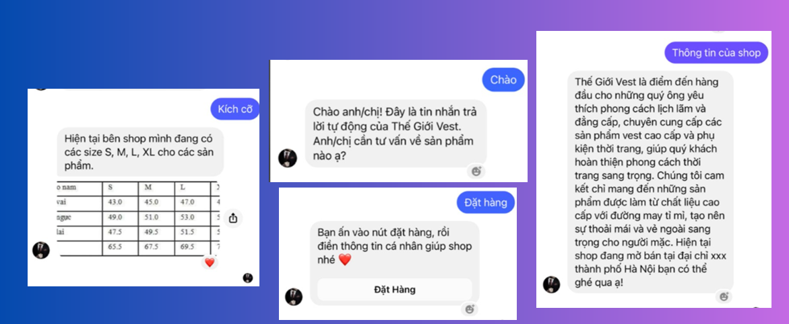
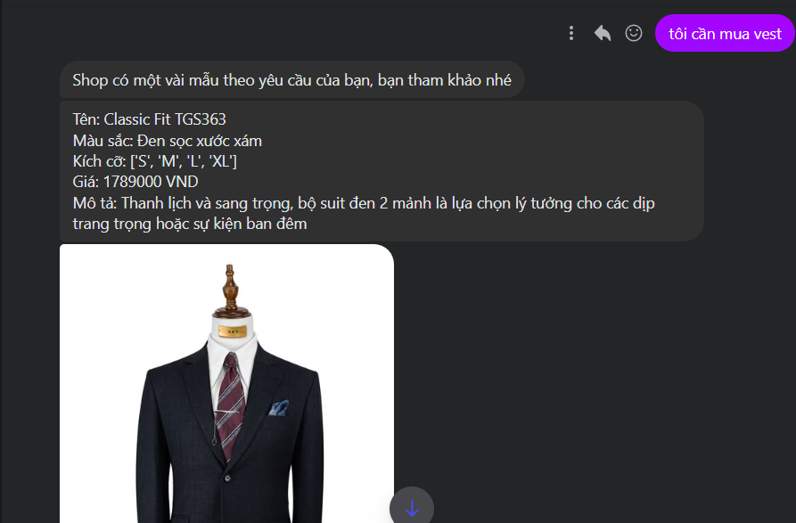

# ChatBot Messenger

Là một dự án cho shop bán quần áo vest nam. Sử dụng các mô hình học máy SVM và BR để phân loại câu hỏi, API messenging meta để thiết lập phản hồi khi có sự kiện.

### Link Fanpage

[Thế Giới Vest](https://www.facebook.com/profile.php?id=61567156943349)

### Technologies Used
- **Frontend**:
  - HTML5, CSS3, JavaScript
  - Jinja

- **Backend**:
  - Flask

- **Tools**:
  - Git
  - Postman cho việc kiểm thử API

- **Deployment**:
  - Heroku cho việc lưu trữ backend

## Project's Screenshots =>

